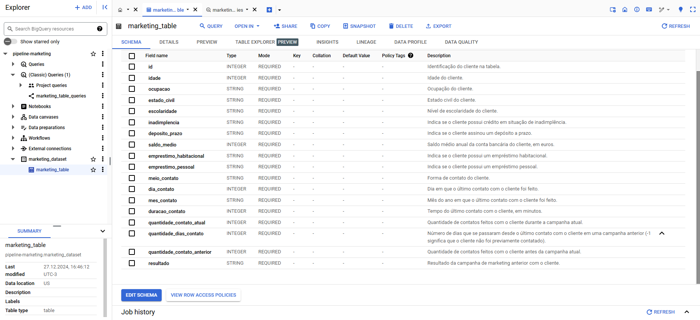

# Pipeline ETL com Dados de Marketing

Pipeline ETL (Extract, Transform, Load) desenvolvido para processar e carregar dados de uma campanha de marketing de um banco.  
O dataset utilizado (*Bank Marketing Dataset*) foi disponibilizado por Janio Martinez Bachmann no *Kaggle*.

## Estrutura do Repositório

- `src`: Pasta contendo as etapas e funções do pipeline ETL.
  - `utils.py`: Funções auxiliares para tratamento e transformação dos dados.
  - `extract_csv.py`: Etapa de extração dos dados a partir de um arquivo CSV.
  - `transform.py`: Etapa de transformação e limpeza dos dados extraídos.
  - `load.py`: Etapa de carregamento dos dados transformados para o BigQuery.
  - `extract_bigquery.py`: Etapa para extrair os dados do BigQuery e exportá-los para um arquivo Excel.
- `data/raw`: Arquivos com dados brutos, ainda não transformados.
- `data/processed`: Arquivos com dados que já passaram pelas etapas de transformação e limpeza.
- `data/logs`: Arquivos logs para monitoramento e acompanhamento do processo de transformação dos dados.
- `docs`: Contém legendas de cada coluna do dataset.
- `README.md`: Documento que descreve o projeto e suas funcionalidades.

## Funcionalidades

Este pipeline realiza as seguintes etapas do processo ETL:

1. **Extração (Extract)**:
   - Os dados são extraídos de um arquivo CSV presente na pasta `data/raw` para um DataFrame utilizando a biblioteca `pandas`.
   - Durante a extração, é registrada a quantidade de linhas e colunas do dataset.

2. **Transformação (Transform)**:
   - **Renomeação de colunas**: As colunas do dataset são renomeadas para um padrão mais legível.
   - **Tratamento de valores ausentes**: Valores ausentes são removidos.
   - **Remoção de duplicatas**: Linhas duplicadas baseadas em um conjunto específico de colunas são removidas.
   - **Mudança de posição de colunas**: A coluna `deposito_prazo` é movida para uma nova posição.
   - **Conversão de valores**: Vários valores são convertidos para formatos mais legíveis e significativos, incluindo transformações de valores booleanos e categóricos.
   - **Formatação**: A coluna `duracao_contato` é convertida de segundos para minutos.
   - Após a transformação, os dados são salvos em um novo arquivo CSV na pasta `data/processed`.

3. **Carregamento (Load)**:
   - Os dados transformados são carregados no Google BigQuery. O script `load.py` cria um dataset e uma tabela no BigQuery e carrega os dados transformados.
   
4. **Exportação de dados (opcional)**:
   - O script `extract_bigquery.py` extrai os dados do BigQuery e os exporta para um arquivo Excel. Esses dados podem ser utilizados em ferramentas de visualização de dados.
   - No final do processo, os dados foram importados para o Tableau para criação de visualizações.

## Conceitos de Programação

- **Variáveis:** Utilizadas para armazenar dados do dataset e configurações personalizadas.
- **Estruturas de Controle:** Uso de estruturas condicionais para manipulação e verificação de dados nos DataFrames.
- **Funções:** Funções são utilizadas para modularizar o código e garantir reutilização.
- **Tratamento de Erros:** O tratamento de erros é feito por meio de de blocos `try/except` para registrar possíveis falhas que possam ocorrer durante a extração dos dados ou no carregamento para o BigQuery.
- **Uso de APIs:** O pipeline utiliza a API do Google BigQuery para carregar os dados transformados no serviço de armazenamento de dados.

## Tecnologias Utilizadas

- **Python**: Linguagem principal utilizada para o desenvolvimento do projeto.
- **Pandas**: Biblioteca utilizada para leitura, manipulação e limpeza dos dados.
- **Google Cloud Platform (GCP)**:
  - **Google SDK**: Utilizado para configurar e autenticar as credenciais necessárias para acessar o BigQuery a partir do código Python.
  - **BigQuery**: Data Warehouse utilizado para armazenar e consultar os dados transformados.
- **Tableau**: Ferramenta de visualização de dados utilizada para criar gráficos e dashboards a partir dos dados extraídos do BigQuery.

## Links Úteis

- **Visualização no Tableau**: [Acesse a Visualização](https://public.tableau.com/app/profile/anavioliveira/viz/DashboardCampanhadeMarketingdeBanco/DashboardCampanhadeMarketingdeBanco)

- **Vídeo com dados carregados no BigQuery**: 
